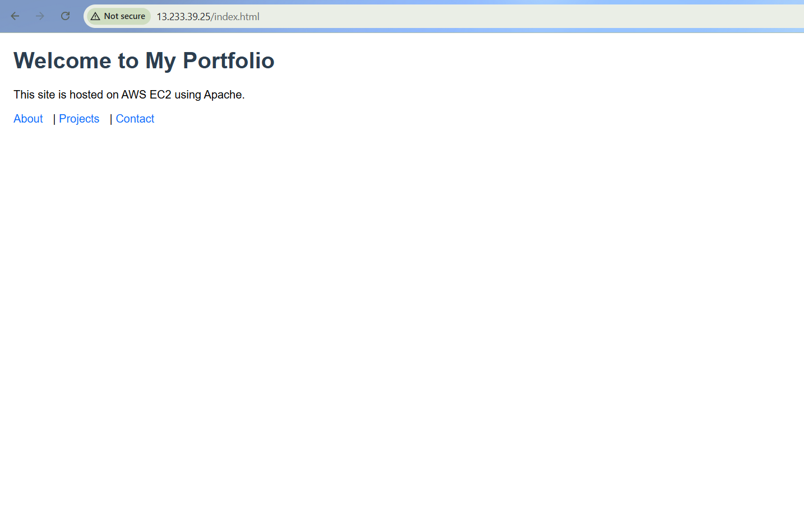
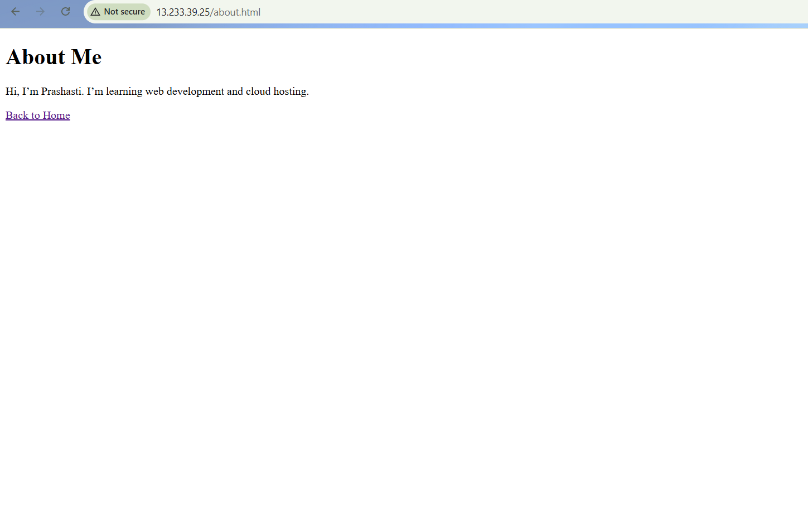
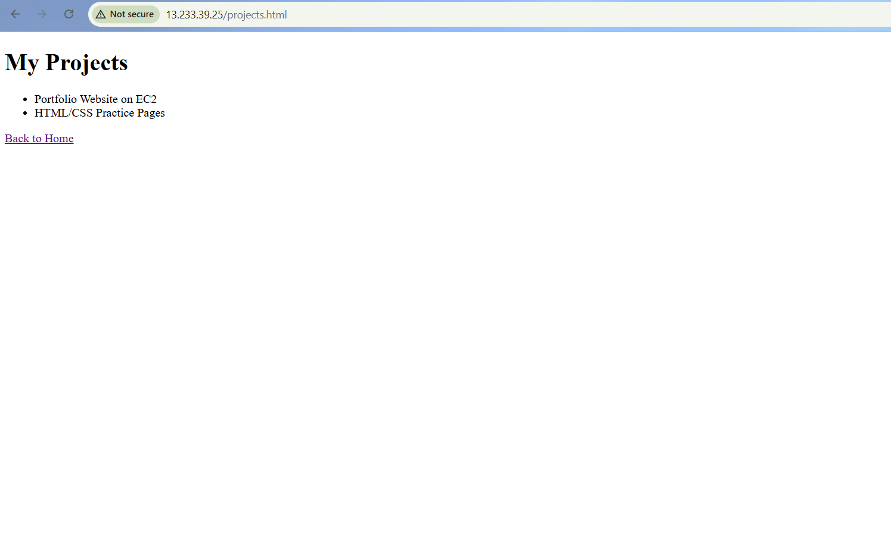
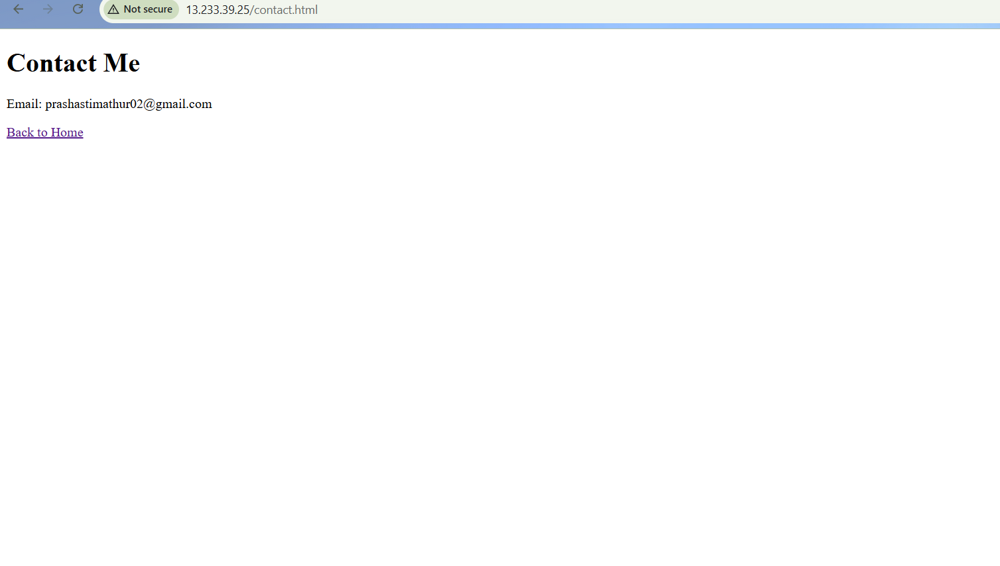

# 🌐 Portfolio Website – Prashasti Mathur

This is my personal portfolio website built using basic HTML and CSS. It’s a simple, clean layout that introduces who I am, showcases my projects, and provides contact information. I’ve deployed it on an AWS EC2 instance using Apache.


## Live Portfolio Links

This project is hosted in two environments to showcase different deployment skills:

- 🚀**GitHub Pages** (Permanent, free hosting):  
  [https://prashastimathur02-glitch.github.io/portfolio-website/](https://prashastimathur02-glitch.github.io/portfolio-website/)  
  This version is always live and accessible. Ideal for recruiters and long-term viewing.

- ☁️**AWS EC2 Instance** (Cloud deployment demo):  
  [http://your-ec2-ip-address](http://your-ec2-ip-address)  
  This version demonstrates cloud hosting using Apache on EC2. May be temporarily offline when the instance is stopped.


## Website Screenshots

Here are a few screenshots of the live site:

### Homepage


### About Page


### Projects Page


### Contact Page



## Project Structure
```
portfolio-website/
├── index.html
├── about.html
├── projects.html
├── contact.html
├── css/
│   └── style.css
├── images/
│   ├── homepage.png
│   ├── about.png
│   ├── projects.png
│   └── contact.png
```

## Deployment Info

- **Frontend**: HTML & CSS
- **Hosting**: AWS EC2 (Ubuntu)
- **Web Server**: Apache2
- **Version Control**: Git & GitHub

### Steps I Followed:
1. Set up an EC2 instance and installed Apache
2. Cloned this GitHub repo into `/var/www/html`
3. Restarted Apache and tested the site using the public IP


## About Me

I’m Prashasti Mathur, currently studying at VIT Bhopal. I’m passionate about web development and cloud deployment, and I’m learning how to manage databases using Oracle APEX. This portfolio is part of my journey to build a strong technical foundation and showcase my work.

- 📧 Email: prashastimathur02@gmail.com  
- 💻 GitHub: [@prashastimathur02-glitch](https://github.com/prashastimathur02-glitch)  
- 🔗 LinkedIn: [linkedin.com/in/prashasti-mathur-69646b324](https://www.linkedin.com/in/prashasti-mathur-69646b324)


## Tags

`HTML` `CSS` `Portfolio` `AWS` `EC2` `Apache` `GitHub` `Student Project`


